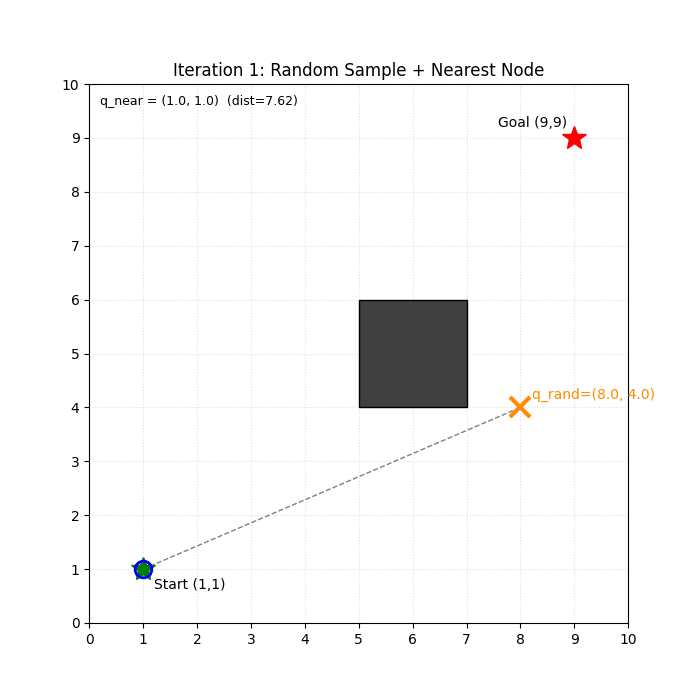
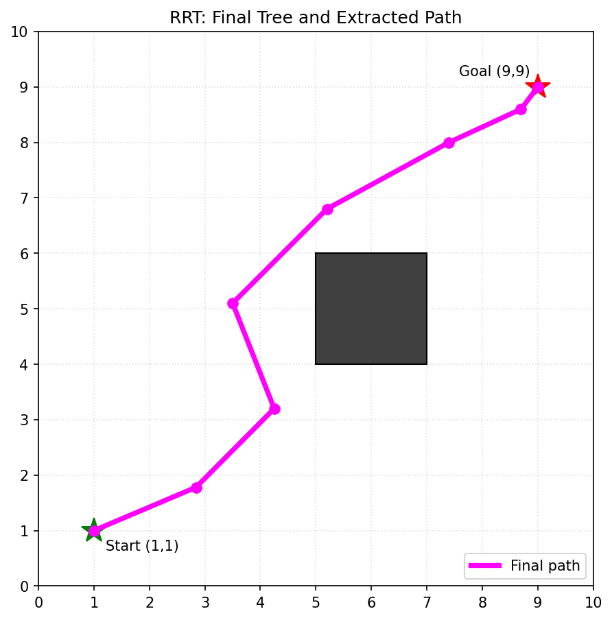
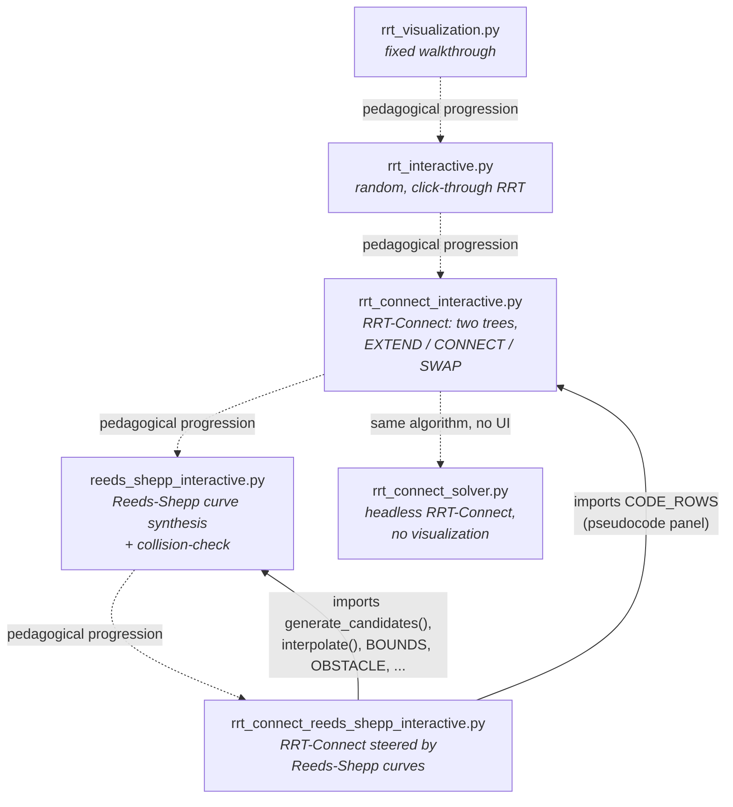
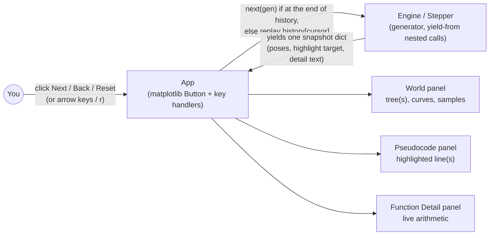

# Motion Planning Visualizers

Six self-contained Python scripts that build up, one concept at a time, to a
Reeds-Shepp-steered RRT-Connect motion planner — written while working
through the sampling-based motion planning sequence for the *Advanced
Mobile Robotics* course (University of Stuttgart, SS26).

Every interactive script uses real randomness and real geometry (nothing
scripted or pre-baked) and lets you click through the algorithm one
micro-step at a time — `Nearest()`, `Steer()` / `NEW_CONFIG()`,
`CollisionFree()` — seeing the actual arithmetic each one computes, not
just the end result.

| Tree growth (animated) | Final tree + path (static) |
|---|---|
|  |  |

Both generated by `rrt_visualization.py`. The four click-through scripts pop
up a live matplotlib window instead, which doesn't screenshot well as a
static image — run them directly (see [Usage](#usage)).

## Table of contents

- [Contents](#contents)
- [Architecture](#architecture)
- [Prerequisites](#prerequisites)
- [Installation](#installation)
- [Usage](#usage)
- [Using `solve()` as a library](#using-solve-as-a-library)
- [Configuring the world](#configuring-the-world)
- [Notes on correctness](#notes-on-correctness)
- [Development](#development)
- [License](#license)

## Contents

| Script | What it shows |
|---|---|
| `rrt_visualization.py` | A fixed, hand-worked-through RRT example (matplotlib animation + static summary PNG) — reproduces a specific walkthrough exactly, node for node, to sanity-check the algorithm by hand first. |
| `rrt_interactive.py` | Interactive RRT: a real-time, click-through (`Next`/`Back`) run with genuine `random.uniform()` sampling, a live pseudocode highlight, and a "Function Detail" panel breaking down `Nearest()`, `Steer()`, and `CollisionFree()` down to the arithmetic. |
| `rrt_connect_interactive.py` | Interactive **RRT-Connect** (Kuffner & LaValle, 2000): two trees, `EXTEND()` / `CONNECT()` / `SWAP()`, with the pseudocode call-stack highlighted across all three published pseudocode blocks as execution moves between them. |
| `reeds_shepp_interactive.py` | Interactive **Reeds-Shepp steering**: enumerates all 12 RS word types × 4 symmetry variants (≈48 candidate curves), picks the shortest (mirroring `OMPL::ReedsSheppStateSpace::getPath()`), then discretizes and collision-checks it segment by segment — this is what a real `EXTEND()` uses in place of straight-line interpolation for a car-like (SE(2)) robot. |
| `rrt_connect_reeds_shepp_interactive.py` | **RRT-Connect + Reeds-Shepp steering, integrated**: the same two-tree `EXTEND()`/`CONNECT()`/`SWAP()` control structure, but every tree node is now a full SE(2) pose, `NEAREST_NEIGHBOR()`'s distance metric is Reeds-Shepp path length (matching `ompl::ReedsSheppStateSpace::distance()`), and `NEW_CONFIG()` steers along the shortest RS curve to the target, truncated to a max arc-length per extend (matching how OMPL's `RRTConnect::growTree()` interpolates when the sample is farther than `maxDistance`). The final path is a real driveable curve — arcs and straight segments, forward and backward — not a polyline. |
| `rrt_connect_solver.py` | The same 2D RRT-Connect algorithm with **no visualization** — a plain CLI/library solver. Start and goal come in via CLI flags; the obstacle is a constant in the source. Exposes a reusable `solve(start, goal, ...)` function. |

## Architecture

### How the scripts relate to each other

Five of the six scripts are fully standalone (each is a complete, runnable
demo on its own). Only `rrt_connect_reeds_shepp_interactive.py` imports
anything — it reuses the Reeds-Shepp math from `reeds_shepp_interactive.py`
and the pseudocode-panel rows from `rrt_connect_interactive.py` rather than
re-deriving either, so there's exactly one implementation of each piece of
math in this repo.



<details>
<summary>ASCII fallback</summary>

```
  rrt_visualization.py           rrt_connect_interactive.py            reeds_shepp_interactive.py
  rrt_interactive.py     ...>    (RRT-Connect: two trees,      ...>    (Reeds-Shepp curve
  (plain RRT)                     EXTEND/CONNECT/SWAP)                  synthesis + collision-check)
                                          |    ^                              |    ^
                                          |    | imports                      |    | imports
                                          |    | CODE_ROWS                    |    | generate_candidates(),
                                          v    |                              v    |  interpolate(), BOUNDS, ...
                                  rrt_connect_solver.py          rrt_connect_reeds_shepp_interactive.py
                                  (headless, no UI)      <...    (RRT-Connect steered by Reeds-Shepp curves)

  ...> = pedagogical progression (concept builds on concept, not a code import)
  solid arrows = actual `import` relationships in the code
```
</details>

### How each interactive script works internally

`rrt_interactive.py`, `rrt_connect_interactive.py`, `reeds_shepp_interactive.py`,
and `rrt_connect_reeds_shepp_interactive.py` all share the same UI pattern:
the algorithm is a Python generator that `yield`s one micro-step at a time
(nested via `yield from`, so a single top-level `next()` call transparently
walks through however many levels of sub-calls — e.g. `PLANNER` calling
`CONNECT` calling `EXTEND`), and a thin `App` class drives it forward or
replays history on `Back` without re-randomizing anything.



## Prerequisites

```
Python 3.9+        (developed/tested on 3.13; no 3.10+-only syntax is used)
matplotlib          -- required by all five interactive/animated scripts
numpy               -- only used by rrt_visualization.py
pillow              -- only used by rrt_visualization.py, for GIF export
```

`rrt_connect_solver.py` needs **none of the above** — it's pure standard
library (`argparse`, `math`, `random`).

## Installation

```bash
git clone https://github.com/VivekSai07/MotionPlanning.git
cd MotionPlanning
pip install matplotlib numpy pillow
```

## Usage

Each interactive script pops up a matplotlib window with `<< Back` /
`Next >>` / `Reset` buttons (arrow keys and `r` also work).

```bash
# Fixed, worked-through example -> saves media/rrt_animation.gif + rrt_final_tree.png
python rrt_visualization.py

# Interactive RRT (pure-uniform sampling by default; toggle goal-bias in the UI)
python rrt_interactive.py
python rrt_interactive.py --seed 42

# Interactive RRT-Connect (two trees, real pseudocode call-stack highlighting)
python rrt_connect_interactive.py
python rrt_connect_interactive.py --seed 1

# Interactive Reeds-Shepp steering
python reeds_shepp_interactive.py
python reeds_shepp_interactive.py --seed 5 --rho 2.0
python reeds_shepp_interactive.py --start 1 1 0 --goal 9 2 0

# Interactive RRT-Connect + Reeds-Shepp steering (the full integration)
python rrt_connect_reeds_shepp_interactive.py
python rrt_connect_reeds_shepp_interactive.py --seed 3 --rho 2.0 --range 6.0

# Headless RRT-Connect solver (no GUI, no matplotlib needed)
python rrt_connect_solver.py --start 1 1 --goal 9 9
python rrt_connect_solver.py --start 1 1 --goal 9 9 --step-size 0.5 --max-iter 5000 --seed 42
```

`rrt_connect_solver.py` prints the solved path and exits:

```
Path found with 15 point(s):
  (1.000, 1.000)
  (1.046, 1.999)
  ...
  (9.000, 9.000)
Total length: 12.973
```

## Using `solve()` as a library

`rrt_connect_solver.py` has no side effects on import, so its core function
is reusable directly:

```python
from rrt_connect_solver import solve

path = solve(start=(1.0, 1.0), goal=(9.0, 9.0), step_size=1.0, seed=42)
if path is None:
    print("no path found")
else:
    print(f"{len(path)} waypoints, from {path[0]} to {path[-1]}")
```

`solve()` returns a list of `(x, y)` tuples from `start` to `goal`, or
`None` if `max_iter` iterations were exhausted without connecting the
trees. It raises `ValueError` if `start` or `goal` lies inside the
obstacle.

## Configuring the world

There is no config file — each script hardcodes its own map as module-level
constants (`START`, `GOAL`, `BOUNDS`, `OBSTACLE`, and, where relevant,
`STEP_SIZE` / `DEFAULT_RHO`). Edit those constants directly to change the
map. Where a script exposes CLI flags (`--seed`, `--rho`, `--range`,
`--start`, `--goal`, `--step-size`, `--max-iter` — see [Usage](#usage) for
which script supports which), those override the corresponding constant
for that run without editing the file.

All scripts default to the same 10×10 world with a 2×2 obstacle at
`x:[5,7], y:[4,6]`, start `(1,1)`, and goal `(9,9)`, for continuity across
the series.

## Notes on correctness

- The RRT / RRT-Connect collision checks, nearest-neighbor search, and
  steering are implemented directly (no external planning library).
- The Reeds-Shepp path-synthesis formulas (all 12 word types) are ported
  from the well-tested, MIT-licensed reference implementation in
  [AtsushiSakai/PythonRobotics](https://github.com/AtsushiSakai/PythonRobotics)
  (`PathPlanning/ReedsSheppPath/reeds_shepp_path_planning.py`), itself
  implementing:
  > J.A. Reeds and L.A. Shepp, "Optimal paths for a car that goes both
  > forwards and backwards," *Pacific Journal of Mathematics*, 145(2),
  > 1990.

  The port was independently verified: driving the synthesized path from
  a start pose must land exactly on the goal pose. Across 200 random
  `(start, goal, turning-radius)` trials, max reconstruction error was
  `~4e-15` (floating-point noise).
- The Reeds-Shepp visualizer treats the vehicle as a point for collision
  checking (an illustrative Opel Corsa F footprint rectangle is drawn at
  the start/goal poses for scale only). Sweeping the full oriented
  rectangle along the curve is a further step, not yet implemented here.
- `rrt_connect_reeds_shepp_interactive.py` was verified headlessly across
  20+ random seeds: every run produces a collision-free, continuous,
  exactly-Start-to-Goal path, every `Advanced` (range-truncated) extend
  stays within the configured max arc-length, and roughly half the runs
  exercise at least one `Trapped` (colliding) extend along the way — so
  that code path is exercised too, not just the happy path.
- `rrt_connect_solver.py` was verified the same way: 15+ seeds all produce
  collision-free paths with exact start/goal endpoints, `max_iter=0`
  correctly returns `None`, and an obstructed start/goal correctly raises
  `ValueError` (surfaced as a clean CLI error, not a traceback).

## Development

There's no CI or formal test suite in this repo — verification so far has
been targeted headless scripts run against each module directly (see
[Notes on correctness](#notes-on-correctness) for what was actually
checked: self-consistency of the Reeds-Shepp port, path validity across
many random seeds, and edge cases like unreachable/obstructed
start-goal pairs). If you add a test suite, `pytest` against the pure
functions is the natural entry point — every script keeps its collision
check, nearest-neighbor, and steering logic (`collision_free` /
`collision_check_detailed`, `steer` / `steer_detailed` /
`new_config_detailed`, `generate_candidates`, `solve`, ...) free of
matplotlib/UI side effects, even though the exact names differ slightly
from script to script.

## License

MIT — see [LICENSE](LICENSE).
